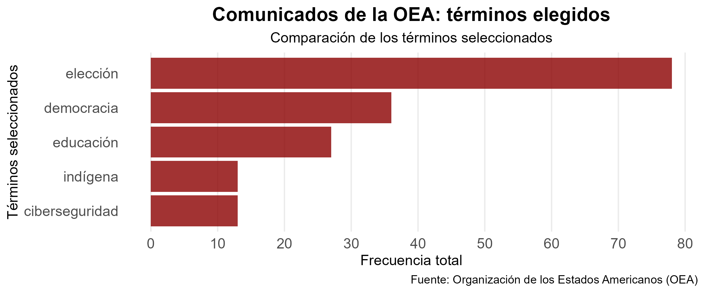

### **Trabajo práctico individual Nº 2: web scraping y procesamiento del lenguaje natural**

Este trabajo pretende aplicar herramientas de web scraping y procesamiento de lenguaje natural. Asimismo, se pretende incorporar las nociones básicas de reproducibilidad y control de versiones. El objeto de trabajo será un conjunto de comunicados de prensa de la Organización de los Estados Americanos (OEA), que tuvieron lugar entre los meses de enero a abril del presente año.

El objetivo empírico será obtener información sobre ciertas témáticas que suelen ser recurrentes en la agenda de la OEA, como la supervisación de elecciones y otras cuestiones similares sobre la democracia. Con esto, se busca comparar su frecuencia con otras temáticas que también suelen tener su espacio dentro de la agenda.

Con el uso de los siguientes términos: democracia, elección, educación, indígena, ciberseguridad, se pretende obtener cierta aproximación a un parámetro que pretenda ilustrar la frecuencia de diversos temarios. La intención es observar cuan distantes o emergentes son aquellos términos que suelen considerarse secundarios (empleo, pueblos originarios o la educación) con respecto a las cuestiones principales previamente nombradas.

La hoja de ruta de ejecución de los archivos será la siguiente

```{r}
library(here) 
# Ejecutar cada etapa en orden 
source(here("TP2/scripts/scraping_oea.R")) 
source(here("TP2/scripts/processing.R")) 
source(here("TP2/scripts/metrics_figures.R")) 
```

Habiéndose realizado el análisis, estos fueron los resultados de la investigación



Con esto, queda en evidencia el liderazgo de cuestiones relacionadas a las elecciones y a la democracia dentro de la agenda de la OEA. En base a esto, se puede señalar que la OEA asigna una marcada importancia al estado en que se llevan a cabo las elecciones dentro de sus países miembros.
